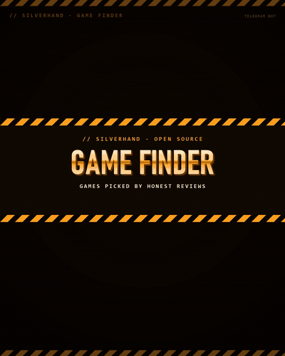
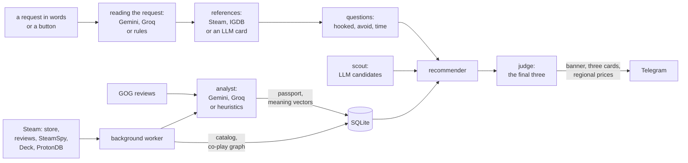

<p align="center">
  
</p>

<p align="center">
  <a href="#self-hosting"><b>Run your own</b></a>
  ·
  <a href="#how-to-use">How to use</a>
  ·
  <a href="#how-it-works">How it works</a>
  ·
  <a href="README.ru.md">Русский</a>
</p>

<p align="center">
  <a href="https://github.com/Fiveloss/silverhand-game-finder/actions/workflows/tests.yml"></a>
  
  
  
  
  <a href="LICENSE"></a>
</p>

---

**Silverhand Game Finder** is a private Telegram bot from the SILVERHAND family that
helps you pick a game to play **right now**. No questionnaire, no taste profile: you say
what you want in your own words ("like Hollow Knight, but easier, for a couple of
evenings", "co-op with a friend, not a shooter") or tap a mood button. The bot asks a
couple of quick questions, finds candidates, checks them against what players say in
recent Steam and GOG reviews, and sends three games as cards, with the reasons they fit
this particular request and the price in your Steam region.

The key idea: a complaint is not always a minus. If players say a game is "too slow"
and you asked for something calm, that counts for it.

<p align="center">
  <a href="assets/brand/promo/promo.mp4"></a>
</p>

<p align="center">
  
</p>
<p align="center">
  
</p>

- 💬 **A request in your own words**: reference games ("like …"), what to stay away
  from ("just not like …", "not a shooter"), length ("for an evening", "to sink into
  for weeks"), difficulty, co-op, and dealbreakers ("no MTX", "in Russian", "for Steam
  Deck"). Without model keys, keyword rules read the request
- 🎯 **Three quick questions, all skippable**: «Чем именно зацепила X?» (What exactly
  hooked you?) with options for that very game (for Hollow Knight: exploration,
  atmosphere, the hand-drawn look, combat, difficulty), «Что точно не надо?» (What
  to avoid?) and «Сколько есть времени?» (How much time?). Tap buttons or answer in
  words ("the atmosphere and exploration, the difficulty drove me mad")
- 🪟 **One panel, no clutter**: the home screen, the questions, the search progress and
  the controls live in one message that is edited in place and moves under the newest
  cards. Game suggestions come as separate card messages
- 🖼 **Cards that move**: a selection banner and three cards with the cover, match with
  the request, review freshness, feel bars, real genres, length, price and Steam Deck
  status, drawn by Pillow and then turned into 2-second animated loops. The caption
  says why this game, quotes a real player, and warns about problems
- 🟢 **Honest about certainty**: 🟢 means the passport was read from N recent reviews,
  ⚪ means a preliminary estimate from player tags
- 💰 **Your prices**: the bot asks your Steam account's region once and shows the
  current price and discount from that store
- 🎛 **Refine in the moment**: shorter, easier, harder, more story, calmer, something
  else entirely, three more, or just type a correction ("no horror", "shorter"). When
  nothing fits, buttons loosen the request. "Already played" and "not this" only drop a
  game from the current selection
- 🔎 **A passport per game**: genres as players name them ("immersive sim",
  "roguelike deckbuilder"), 12 feel axes from 0 to 10, what is praised, what is
  criticised, quality flags, and the game now versus at launch. Taste complaints
  ("too slow") are kept apart from quality ones (bugs, performance, MTX: always a minus)
- 📊 **Honest review numbers**: recent apart from all time, what players with 10+ hours
  say, the share of negatives from players who quit within 2 hours, and the GOG rating
  next to Steam's
- 🌐 **References beyond Steam**: an Epic exclusive or a console game works as a "like …"
  too, through IGDB or a card from a free LLM. Titles are matched strictly: Alan Wake 2
  never turns into Alan Wake
- 👥 **What players like you play**: a co-play graph built from the public libraries of
  Steam reviewers, and meaning-based matching that quotes real reviews
- 🧠 **Free LLMs, optional**: Gemini Flash Lite, Gemini Flash and Groq read the reviews,
  understand the request, propose candidates and judge the final three, each on the job
  it does best within its free quota. The
  keys are free, need no card, and are optional: without them the bot runs on heuristics
- 🙈 **Remembers nothing about your taste**: only your Steam region (for prices) and
  the current request; every new request starts from scratch
- 🔒 **Friends only**: the owner lets people in with one tap
- 🪶 **Light**: one process, SQLite, at most 300 MB of RAM, a daily backup of its own

The passport axes: pace, difficulty, story, freedom, complexity, grind, tension,
combat, exploration, social, length, replay. Sources: Steam and GOG reviews, SteamSpy
player tags, Steam store facts and prices, the Steam Deck Verified report, ProtonDB
ratings and, optionally, IGDB and Reddit discussions.

## How to use

The bot speaks Russian; button names below are given with a translation.

1. Write what you feel like playing now, or tap a mood on the home screen:
   **🎯 Похожее на игру** (Like a game), **🌙 На вечер** (For an evening),
   **♾ Залипнуть надолго** (Something long), **🤝 С другом** (With a friend),
   **😌 Расслабиться** (Chill), **🔥 Челлендж** (Challenge), **📖 Сюжет** (Story),
   **💎 Жемчужины** (Hidden gems), **🎲 Удиви меня** (Surprise me). A mood button
   searches at once.
2. Before the first search the bot asks your Steam account's region (Russia,
   Kazakhstan, Ukraine, Belarus, USA, Europe, UK, Turkey or any two-letter code).
   Change it later with **🌍 Регион Steam** (Steam region) on the home screen.
3. Answer the questions or skip them with **⚡ Подобрать сейчас** (Pick now):
   «Чем именно зацепила X?» (only when you named a game: toggle options, «Всё сразу»
   for all of it, or answer in words), «Что точно не надо?» (horror, shooters, hard,
   grind, MTX, reading, online and PvP, no Russian, early access; what you already
   wrote is ticked) and «Сколько есть времени?» (an evening, a couple of evenings, a
   week, long, doesn't matter; skipped when the request already says).
4. A selection banner and three cards arrive. Under each: **🔎 Подробно** (Details:
   the game's passport), **Steam ↗**, **✅ Уже играл** (Already played), **👎 Не то**
   (Not this). Below them the panel asks «Подкрутить?» (Adjust?) with the refine
   buttons, **🔄 Ещё 3** (Three more) and **◂ В начало** (Home). Typing anything here
   corrects the current request.
5. If nothing fits, the bot says so and offers **Снять исключения** (Drop the
   exclusions), **Любая длина** (Any length) and **Совсем другое** (Something else).
6. **🔎 Разбор игры** (Game breakdown) or `/game` gives the passport of any game by name
   (Russian or English), with **🎯 Найти похожие** (Find similar) under it.

Your own messages are deleted once read, so the chat holds only the cards and the panel.

<p align="center">
  
</p>

| Command | What it does |
|---|---|
| `/find` | the home screen: write a request or tap a mood |
| `/game` | a game's breakdown from its reviews (same as **🔎 Разбор игры**) |
| `/help` | how it works |
| `/start` | a greeting and the home screen |
| any text | a request in your own words, or a correction of the current one |

| Button under a selection | What it changes |
|---|---|
| Покороче (Shorter) | at most 60% of the shown games' typical length (or of the current limit) |
| Попроще / Посложнее (Easier / Harder) | difficulty 2 below or above the games shown |
| Сюжетнее (More story) | story 2 above the games shown (at least 7/10), and the Story Rich tag |
| Спокойнее (Calmer) | tension up to 3, difficulty at most 6 out of 10 |
| Совсем другое (Something else) | no pull towards the references and the games shown; their shared tags count against |
| 🔄 Ещё 3 (Three more) | the next three for the same request |

The request's limits stay, and games already shown don't come back. A written
correction is merged into the request: what it mentions wins, the rest stays; naming
a new game starts a new search.

**What's in a passport:** the real genre next to the store genre; reviews of all time,
recent, among players with 10+ hours, and the share of negatives within 2 hours of
play; the GOG rating; length; Russian (text, audio); price in your region; Steam
Deck compatibility; what you do minute to minute; all 12 axes; what is praised and what
is criticised, with taste complaints marked as such; how the game is now, who it suits,
who should skip it, what it is compared to.

## How it works



- **The catalog.** Once a day the bot walks Steam's store lists: top sellers, top
  rated and popular new releases. For each game it fetches SteamSpy's tags (voted by
  players, which is the "real genre") and the store facts: Russian text and audio,
  early access, in-app purchases, co-op, DRM, 18+, plus Steam's Deck Verified report
  and ProtonDB's crowd rating. Games with 200+ reviews are recommendable. The
  background work steps aside while a player is waiting, since both share Steam's
  rate limits.
- **Reading the request.** One call to a free LLM turns the message into a request:
  reference games and games to avoid, a mood, targets on the feel axes, hours, co-op,
  dealbreakers, Steam tags to pull towards or push away from, and the experience in the
  player's own words for meaning-based matching. Keyword rules also look for
  dealbreakers and co-op: an extra filter is better than a missed one. Without keys or
  past a rate limit, the rules alone read the request. A correction typed later is read
  the same way and merged into the current request.
- **References.** A title is matched strictly: if Steam doesn't have that exact game,
  the bot won't substitute one with a similar name. A game outside Steam is looked up
  in IGDB (which also links other stores, so the game may turn up on Steam under another
  name), and the LLM describes it as a card: tags, feel axes, what people love about it,
  and the Steam games it is compared to. Such a game serves as a reference; the picks
  still come from the Steam catalog.
- **"What exactly hooked you?"** The options come from what reviewers praise in that
  game, its strongest axes and its player tags, up to six. What the player picks becomes
  the request's targets and words for meaning-based matching; the reference's other axes
  barely count any more, and its tags tied to the unpicked options pull four times
  weaker. Whatever "drove them mad" counts against. The exclusions and the time answer
  become dealbreakers, tags to avoid, axis limits and hours.
- **Reviews.** Four requests to Steam per game: recent reviews in all languages, recent
  English and Russian ones, and the most helpful of the past year. From them: the
  positive share of all time and among recent reviews, among players with 10+ hours,
  the share of negatives from players under 2 hours (the refund window), and the median
  hours of happy players. Rankings use the Wilson lower bound: 9 out of 10 ranks below
  900 out of 1000. When the game is on GOG, up to 20 of its reviews join the sample and
  its GOG rating is shown alongside.
- **Reading ahead.** A search never waits for reviews. The background worker reads the
  catalog ahead, most popular first, within 80% of the day's model budget; candidates
  it has not reached yet work from their player tags (a ⚪ card) and go first in its
  queue, together with the next likely candidates, so "three more" and the next request
  already have them. Only a game breakdown, or a reference game never read before,
  reads reviews on the spot.
- **The passport.** The model reads up to 60 reviews (25 for Groq, whose free tier
  allows few tokens a minute), with negatives over-sampled (at least 35%) and the real
  share passed separately. Each complaint is either about quality (bugs, performance,
  monetization, abandoned development, servers) or about taste, with an axis and a
  direction: "too slow" is pace, low. Each job has its own order of providers: the free
  Gemini Flash quota is tiny (about 20 calls a day), so it is kept for the judge; reviews
  are read by Gemini Flash Lite (same key, a much bigger quota), then Groq; quick calls a
  player waits for (understanding the request, the scout, cards of non-Steam games) go to
  Groq, then Flash Lite with little "thinking", and have short timeouts. A provider that
  hits a per-minute limit (HTTP 429) rests for 90 seconds, 10 minutes if it happens again;
  a daily limit rests it until the quota resets (Gemini says when). Without keys,
  past the daily cap or when nobody answers, the passport is built by heuristics from
  tags and keywords and is read again by a model later. A passport lasts 30 days.
- **Meaning-based matching.** For every analysed game, Gemini's free embedding model
  (`gemini-embedding-001`) builds an experience vector (summary, core loop, praise) and
  vectors for up to 20 short review snippets. The player's words and references are
  compared with them, and the closest snippet goes into the card's caption as a
  player's quote. Missing vectors are rebuilt in the background.
- **The co-play graph.** With a Steam Web API key, the background worker reads the
  public libraries of players who put many hours into a game and recommended it, and
  keeps only totals: which other games take up many of their hours. Links are corrected
  for popularity, so CS2 and Dota 2 don't look "similar" to everything. Steam ids and
  libraries never reach the database or the log.
- **The scout.** Tag similarity finds games of the same genre, not the same experience,
  so one LLM call proposes up to 15 games for what the player loved, each with a reason.
  Every title is matched strictly on Steam and then scored like any other candidate.
- **Genre and format first.** A reference game is anchored by its most pronounced genres
  (the genre tags with the most player votes; close ones count as one family: survival
  horror and psychological horror are both horror). A candidate must share its main genre
  or two of its defining ones, and its format: 2D vs 3D and turn-based vs real-time combat
  are hard rules, another camera only costs score. Nothing gets around this, neither the
  co-play graph nor the scout: a game everyone plays is no match for Resident Evil unless
  it is a horror game too. The reference itself in another edition never comes up; one
  game of its series at most, and always last.
- **What it is loved for.** Without the player's own answer to «Чем зацепила?», the bot takes
  what the reference's reviews praise most (story, builds, exploration…; never music, looks or
  setting) and scores each candidate on being strong at the same things.
- **Picking.** Tag similarity is the cosine between SteamSpy tag vectors weighted by
  IDF (capped, so one rare shared tag doesn't make two games twins); a candidate must
  share enough with the references, or be backed by the co-play graph or the scout.
  The score is about 35% tags (minus half the similarity to what to avoid), 25% feel,
  25% quality (Wilson, recent reviews and 10+ hour players), 15% complaints, plus a mood
  bonus; for a tag-only passport, tags weigh more and feel less. The scout, meaning-based
  matching and the co-play graph take their share when there is data for the game.
  Taste complaints pointing the request's way count for the game, the others against
  it; quality complaints always count against. Hours, co-op, difficulty, tension,
  length, grind and social are hard limits; story, exploration and the other axes are
  wishes that move the score. The best are spread out (a penalty for tag similarity to
  the games already chosen, one game per series), and when exact matches run short, the closest games
  without the hard limits fill in, marked as a compromise.
- **The judge.** With a key and quota left, the model reads the top dozen candidates
  next to the request (tag-only ones say so) and picks three, with a concrete reason and
  a risk for each (the card says "выбор ИИ", AI pick). Passports are data to it, never
  instructions.
- **Prices.** Before each selection the bot asks Steam's store for the current price
  and discount in the player's region, cached for an hour; a game the region doesn't
  sell says so.
- **Cards.** Pillow draws them with fonts bundled in the repo (nothing to install on the
  server): a 1280×720 picture per game, sent at once. With `ANIMATE_CARDS=1` each one is
  then swapped for a 2-second MP4 loop (the bundled ffmpeg of `imageio-ffmpeg`, one encode
  at a time); if anything fails, the picture stays. Steam covers are cached on disk.
- **Upkeep.** Once a day the worker backs up the database to `data/backups` (gzipped,
  the last 3 kept), drops covers unused for 60 days or past 150 MB, prunes vectors of
  games that are gone, stale non-Steam cards and old queue rows, and checkpoints the
  SQLite log. Profile data left by versions before 0.2 is purged once.
- **Spending under control.** `LLM_DAILY_GAMES` caps the review analyses a day (UTC).
  It costs no money: the cap keeps the bot from draining the free quotas. The background
  takes at most 80% of it, the rest waits for players' requests. The scout, the judge and
  reading the request only add their tokens; past the cap they stop too, and the bot runs
  on heuristics until tomorrow. The owner sees usage in `/stats`.

## Self-hosting

You need Python 3.10+ with `python3-venv`, Linux with systemd and root (the script
installs a service), at least 400 MB of free memory, and a bot token from
[@BotFather](https://t.me/BotFather). The server must reach `api.telegram.org`,
`store.steampowered.com`, `steamspy.com`, `www.protondb.com`, `catalog.gog.com`,
`reviews.gog.com` and `*.steamstatic.com` (covers); optionally
`generativelanguage.googleapis.com` (Gemini), `api.groq.com` (Groq), `api.igdb.com` and
`id.twitch.tv` (IGDB), `api.steampowered.com` (the co-play graph) and `reddit.com`.
Gemini is not available in every country; where it isn't, Groq alone is enough (without
meaning-based matching).

```bash
git clone https://github.com/Fiveloss/silverhand-game-finder.git gamefinder && cd gamefinder
bash deploy/install.sh        # creates .env and stops
nano .env                     # BOT_TOKEN, OWNER_IDS, optionally Gemini, Groq and IGDB keys
bash deploy/install.sh        # tests → DB snapshot → systemd service
journalctl -u gamefinder -f
```

`install.sh` refuses to start the bot if less than 400 MB of memory is free
(`MIN_FREE_MB`) or the offline tests fail (it runs every `tests*.py` with
`GF_TIMING=0`, so speed checks don't fail a deploy on a busy server), and it won't
overwrite a `gamefinder` service that belongs to another directory. Before restarting
it snapshots the database to `data/backups` (the last 2 snapshots are kept), then waits
up to 30 seconds for the bot to start polling Telegram and prints the log if it
doesn't. It touches only its own directory (`venv/`, `data/`, `.env`) and
`/etc/systemd/system/gamefinder.service`.

The unit caps the bot at 300 MB of RAM and 30% of a CPU, so it can share a small
server, and sandboxes it: the file system is read-only except `data/`, with no new
privileges and a private `/tmp`. A bad `.env` makes the bot exit with code 78, which
systemd does not restart, so a typo never turns into a restart loop. Extra
restrictions for a particular server go in `deploy/server-hardening.conf` (kept out of
the repo): the script adds it as a drop-in.

To update: `git pull && bash deploy/install.sh`. It reinstalls the requirements, reruns
the tests and restarts the service; the database in `data/` and `.env` stay.

<details>
<summary><b>Configuration</b> (<code>.env</code>)</summary>

| Variable | Default | Meaning |
|---|---|---|
| `BOT_TOKEN` | — | from @BotFather |
| `OWNER_IDS` | — | the owners' Telegram ids, comma-separated (@userinfobot tells yours): they let people in and see `/stats` |
| `ALLOWED_IDS` | — | friends' ids the bot answers; owners can also use `/allow id` or the "let in" button |
| `OPEN_ACCESS` | `0` | `1` makes the bot answer everyone; every game breakdown uses up the free daily model quota |
| `GEMINI_API_KEY` | — | Google Gemini key: reviews and requests, the scout, the judge, meaning-based matching; free, no card: [aistudio.google.com/apikey](https://aistudio.google.com/apikey) |
| `GEMINI_MODEL` | `gemini-flash-latest` | the main Gemini model |
| `GEMINI_LITE_MODEL` | `gemini-flash-lite-latest` | the fallback Gemini model (same key, its own and usually bigger free quota) |
| `GEMINI_EMBED_MODEL` | `gemini-embedding-001` | the embedding model for meaning-based matching (same key); changing it wipes the vectors, which are then rebuilt over days |
| `GROQ_API_KEY` | — | Groq key, the last fallback while Gemini rests after a rate limit or fails; free: [console.groq.com/keys](https://console.groq.com/keys) |
| `GROQ_MODEL` | `openai/gpt-oss-120b` | the Groq model |
| `LLM_DAILY_GAMES` | `500` | review analyses a day (UTC); the background takes at most 80%; after that, heuristics until tomorrow |
| `IGDB_CLIENT_ID` · `IGDB_CLIENT_SECRET` | — | a Twitch app for IGDB: games outside Steam as references; free |
| `STEAM_API_KEY` | — | Steam Web API key: the co-play graph from the public libraries of reviewers |
| `REDDIT_CLIENT_ID` · `REDDIT_CLIENT_SECRET` | — | a Reddit "script" app: discussions as one more source |
| `STORE_CC` | `kz` | Steam store region for the catalog and game facts; card prices come from each player's own region |
| `ANIMATE_CARDS` | `1` | `1` turns cards into 2-second loops (ffmpeg comes with the requirements); `0` keeps pictures |
| `PASSPORT_MAX_AGE_DAYS` | `30` | days before a passport is rebuilt |
| `CATALOG_PAGES` | `10` | catalog depth: once a day the bot takes `CATALOG_PAGES` × 400 top sellers, × 200 top rated and 200 popular new releases |
| `DB_PATH` | `data/gamefinder.db` | the database file |
| `LOG_LEVEL` | `INFO` | log verbosity |

Every key except `BOT_TOKEN` is optional: set one, several or none (then heuristics
only). Step-by-step instructions for getting them and the free-tier limits are in
[`.env.example`](.env.example) (in Russian).

Owner commands in the private chat: `/stats` (catalog, analysis queue, model usage per
day) and `/allow <id>`. When a stranger writes to the bot, they get their id, and the
owners get a card with a "let in" button.
</details>

Texts and pictures for the bot's @BotFather profile are in
[docs/botfather.md](docs/botfather.md) (in Russian).

## Development

```bash
pip install -r requirements.txt
python3 tests.py              # no network, no Telegram, no keys
python3 tests_bot.py          # the Telegram layer against a fake Bot API
python3 tests_intent.py       # reading requests (the other tests_*.py run the same way)
python3 -m gamefinder.main    # run with .env, from the project directory
```

The tests are plain Python files with no framework: each `tests*.py` runs on its own.
`GF_TIMING=0` switches off the speed checks of the card renderer.

| Path | What lives there |
|---|---|
| `gamefinder/main.py` · `config.py` | start-up and a quick shutdown; settings (exit code 78 on a bad `.env`) |
| `gamefinder/bot.py` | the panel, the questions, cards and buttons, commands, the session and region, access |
| `gamefinder/intent.py` | a request in words → `Request`; written corrections (`merge`); the refine and loosen buttons |
| `gamefinder/aspects.py` | "what exactly hooked you?": options per game, answers in words, how they steer the request |
| `gamefinder/service.py` | `recommend_now`, references, `aspect_options`, regional prices, analysis, the background worker |
| `gamefinder/recommender.py` · `taste.py` | scoring, hard limits, diversity; the taste of one request |
| `gamefinder/genres.py` | a game's defining genres and format from its player tags, and the rules for a match |
| `gamefinder/suggest.py` · `rerank.py` | the scout: LLM-proposed candidates; the judge: the final three, with reasons |
| `gamefinder/analyst.py` · `reviews.py` | the game passport: schema, Gemini and Groq with rate-limit rests, heuristics; review statistics |
| `gamefinder/semantic.py` · `coplay.py` | meaning-based matching and quotes; the co-play graph |
| `gamefinder/external.py` · `titles.py` | LLM cards for games outside Steam; strict title matching |
| `gamefinder/views.py` · `texts.py` | what the cards and captions show; message texts in the house style |
| `gamefinder/render.py` · `animate.py` | drawing the banner and the cards; turning a card into a 2-second MP4 loop |
| `gamefinder/maintenance.py` | the daily backup and cleanup |
| `gamefinder/sources/` | Steam (store, reviews, prices), SteamSpy, GOG, IGDB, Reddit, Steam Deck Verified and ProtonDB |
| `gamefinder/db.py` · `http.py` | SQLite; HTTP with per-host pacing |
| `deploy/` | `install.sh` and the systemd unit |
| `tools/make_intro.py` · `make_cards.py` | the description animation, the menu screens' animations and the banner; the README card previews |
| `tools/eval_picks.py` · `golden.json` | real requests through the whole pipeline on a copy of the database: picks, score parts, the judge's reasons, timing; `--golden` checks 30 requests against games that fit and games that must never come up |

## Privacy

The bot remembers nothing about your taste: no questionnaire, no profile, no rating
history. It keeps your Telegram id and first name (for access), your Steam store region
(for prices) and the current request with the games already shown for it, so "three
more", the refine buttons and corrections work; the next request overwrites it. "Already
played" and "not this" only affect the current selection. Profile data stored by
versions before 0.2 is deleted by the daily upkeep. The models (Gemini, Groq) get the
request's text, public reviews and game facts, never your name or id. On the free tier
Google may use requests to improve its products, so don't put anything personal in a
request. The co-play graph keeps only per-game totals, without Steam ids or anyone's
library. Backups stay on the server, in `data/backups`, readable by its owner only.

## Disclaimer

Silverhand Game Finder is not affiliated with Valve, Steam, SteamSpy, ProtonDB, GOG,
IGDB, Twitch, Reddit, Google or Groq. A passport sums up what players write and can be
wrong; without a language model it is a rough estimate from tags and keywords.

## License

[AGPL-3.0](LICENSE). You can use, change and run this code. If you run a modified
copy as a service for others, you must offer them its source.
