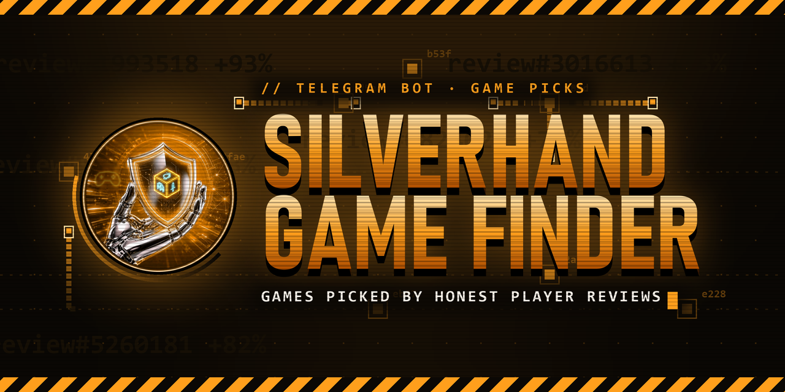
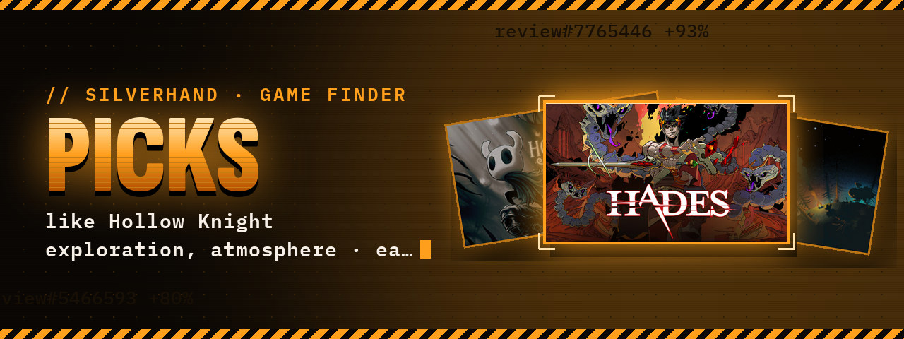
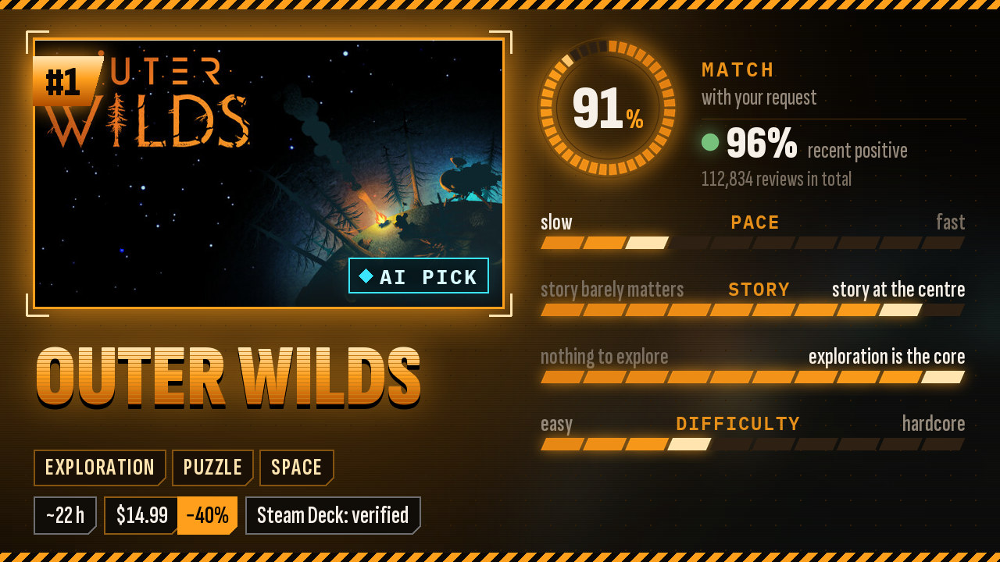
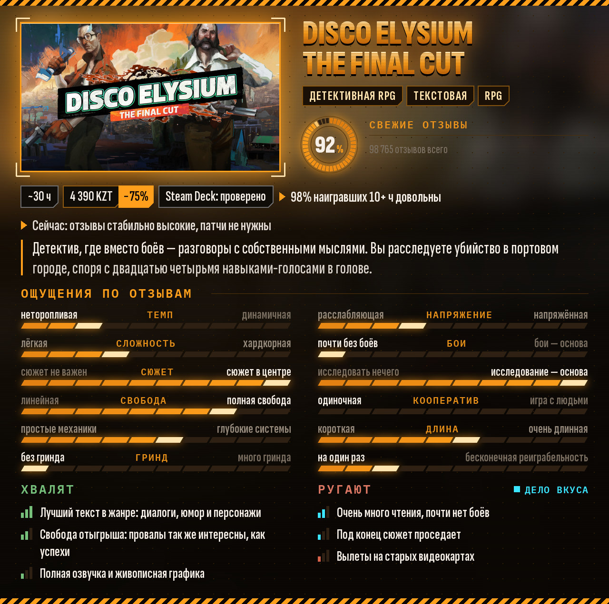
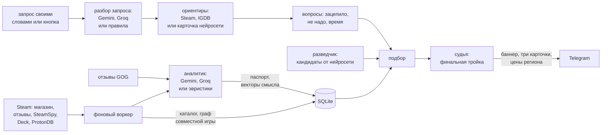

<p align="center">
  
</p>

<p align="center">
  <a href="#свой-сервер"><b>Запустить своего бота</b></a>
  ·
  <a href="#как-пользоваться">Как пользоваться</a>
  ·
  <a href="#как-устроено">Как устроено</a>
  ·
  <a href="README.md">English</a>
</p>

<p align="center">
  <a href="https://github.com/Fiveloss/silverhand-game-finder/actions/workflows/tests.yml"></a>
  
  
  
  
  <a href="LICENSE"></a>
</p>

---

**Silverhand Game Finder** — приватный Telegram-бот из экосистемы SILVERHAND, который
помогает выбрать, во что поиграть **прямо сейчас**. Никаких анкет и профиля вкуса:
пишешь своими словами, что хочется, — «как Hollow Knight, но проще, на пару вечеров»,
«кооп с другом, не шутер» — или жмёшь кнопку настроения. Бот задаёт пару коротких
вопросов, находит кандидатов, сверяет их с тем, что игроки пишут в свежих отзывах Steam
и GOG, и присылает три игры карточками — с объяснением, почему они подходят именно под
этот запрос, и с ценой в твоём регионе Steam.

Главная идея: жалоба — не всегда минус. Если игру ругают «слишком медленная», а ты
просишь что-то спокойное, для тебя это довод за неё.

<p align="center">
  
</p>
<p align="center">
  
</p>

- 💬 **Запрос своими словами:** игры-ориентиры («как …»), чего избегать («только не
  как …», «не шутер»), длина («на вечер», «залипнуть надолго»), сложность, кооператив и
  стоп-факторы («без доната», «на русском», «для Steam Deck»). Без ключей нейросети
  запрос разбирают правила по ключевым словам.
- 🎯 **Три коротких вопроса, любой можно пропустить:** «Чем именно зацепила X?» с
  вариантами именно для этой игры (у Hollow Knight это исследование, атмосфера,
  рисованный стиль, бои, сложность), «Что точно не надо?» и «Сколько есть времени?».
  Можно отметить кнопками или ответить словами («атмосфера и исследование, а сложность
  бесила»).
- 🪟 **Одна панель вместо ленты сообщений:** главный экран, вопросы, ход поиска и
  кнопки подкрутки живут в одном сообщении, которое правится на месте и переезжает под
  свежие карточки. Сами игры приходят отдельными сообщениями-карточками.
- 🖼 **Живые карточки:** баннер подборки и три карточки — обложка, совпадение с
  запросом, свежесть отзывов, шкалы ощущений, настоящие жанры, длина, цена, Steam Deck.
  Рисует их Pillow, потом они превращаются в короткую анимацию на 2 секунды. В подписи —
  почему эта игра, цитата живого игрока и предупреждения.
- 🟢 **Честно о точности:** 🟢 — разбор по N свежим отзывам, ⚪ — предварительно, по
  тегам игроков.
- 💰 **Твои цены:** бот один раз спрашивает регион аккаунта Steam и показывает текущую
  цену и скидку из этого магазина.
- 🎛 **Подкрутить на ходу:** «Покороче», «Попроще», «Посложнее», «Сюжетнее»,
  «Спокойнее», «Совсем другое», «Ещё 3» — или просто напиши поправку («без хоррора»,
  «покороче»). Если ничего не нашлось, кнопки ослабят запрос. «Уже играл» и «Не то»
  убирают игру только из текущей подборки.
- 🔎 **Паспорт игры:** жанры, как их называют игроки («иммерсив-сим», «рогалик-колодостроитель»),
  12 осей ощущений от 0 до 10, что хвалят, что ругают, проблемы качества и какая игра
  сейчас по сравнению с релизом. Жалоба на вкус («слишком медленно») отделена от жалобы
  на качество (баги, оптимизация, донат — всегда минус).
- 📊 **Честная статистика отзывов:** свежие отдельно от всех, мнение наигравших 10+ часов,
  доля негатива от тех, кто бросил в первые 2 часа, и оценка GOG рядом со Steam.
- 🌐 **Ориентиры не только из Steam:** эксклюзив Epic или консольная игра тоже годится
  как «как …» — через базу IGDB или карточку от бесплатной нейросети. Названия
  сверяются строго: Alan Wake 2 не превратится в Alan Wake.
- 👥 **Что играют такие же игроки:** граф совместной игры по открытым библиотекам
  авторов отзывов Steam и поиск по смыслу с цитатами из отзывов.
- 🧠 **Бесплатные нейросети по желанию:** Gemini Flash Lite, Gemini Flash и Groq читают
  отзывы, понимают запрос, предлагают кандидатов и выбирают финальную тройку — каждая на
  той работе, где она лучше в пределах своего бесплатного лимита. Ключи бесплатные, без карты и необязательны: без них бот работает на эвристиках.
- 🙈 **Не помнит твой вкус:** хранит только регион Steam (для цен) и текущий запрос;
  каждый новый запрос — с нуля.
- 🔒 **Только для своих:** владелец пускает друзей одной кнопкой.
- 🪶 **Лёгкий:** один процесс, SQLite, до 300 МБ памяти, сам делает ежедневную копию базы.

Оси паспорта: темп, сложность, сюжет, свобода, глубина механик, гринд, напряжение,
бои, исследование, игра с людьми, длина, реиграбельность. Источники: отзывы Steam и
GOG, теги игроков из SteamSpy, факты и цены магазина Steam, отчёт Steam Deck Verified,
оценка ProtonDB и, по желанию, IGDB и обсуждения на Reddit.

## Как пользоваться

1. Напиши боту, что хочется сейчас, или выбери настроение на главном экране:
   **🎯 Похожее на игру**, **🌙 На вечер**, **♾ Залипнуть надолго**, **🤝 С другом**,
   **😌 Расслабиться**, **🔥 Челлендж**, **📖 Сюжет**, **💎 Жемчужины**, **🎲 Удиви меня**.
   Кнопка настроения сразу запускает поиск.
2. Перед первой подборкой бот спросит регион аккаунта Steam (Россия, Казахстан,
   Украина, Беларусь, США, Европа, Великобритания, Турция или любой двухбуквенный код).
   Поменять его можно кнопкой **🌍 Регион Steam** на главном экране.
3. Ответь на вопросы или пропусти их кнопкой **⚡ Подобрать сейчас**: «Чем именно
   зацепила X?» (только если назвал игру: отметь пункты, выбери «Всё сразу» или ответь
   словами), «Что точно не надо?» (хоррор, шутеры, сложно, гринд, донат, чтение, онлайн
   и PvP, без русского, ранний доступ; то, что уже было в запросе, отмечено) и «Сколько
   есть времени?» (вечер, пара вечеров, неделя, надолго, неважно; вопрос пропускается,
   если в запросе это уже сказано).
4. Придут баннер подборки и три карточки. Под каждой: **🔎 Подробно** (паспорт игры),
   **Steam ↗**, **✅ Уже играл**, **👎 Не то**. Ниже панель «Подкрутить?» с кнопками
   подкрутки, **🔄 Ещё 3** и **◂ В начало**. Всё, что напишешь здесь, — поправка к
   текущему запросу.
5. Если ничего не подошло, бот так и скажет и предложит **Снять исключения**,
   **Любая длина** и **Совсем другое**.
6. **🔎 Разбор игры** или `/game` — паспорт любой игры по названию (можно по-русски),
   под ним кнопка **🎯 Найти похожие**.

Твои сообщения бот удаляет, как только прочитал: в чате остаются только карточки и панель.
Интерфейс на русском.

<p align="center">
  
</p>

| Команда | Что делает |
|---|---|
| `/find` | главный экран: написать запрос или выбрать настроение |
| `/game` | разбор игры по отзывам (то же, что **🔎 Разбор игры**) |
| `/help` | как это работает |
| `/start` | приветствие и главный экран |
| любой текст | запрос своими словами или поправка к текущему |

| Кнопка под подборкой | Что меняет |
|---|---|
| Покороче | не дольше 60% типичной длины показанных игр (или текущего ограничения) |
| Попроще / Посложнее | сложность на 2 ниже или выше, чем у показанных |
| Сюжетнее | сюжет на 2 выше, чем у показанных (не меньше 7 из 10), и тег Story Rich |
| Спокойнее | напряжение до 3, сложность не выше 6 из 10 |
| Совсем другое | не тянуть к ориентирам и показанным играм, их общие теги — в минус |
| 🔄 Ещё 3 | следующие три по тому же запросу |

Ограничения запроса при этом сохраняются, а показанные игры больше не возвращаются.
Поправка словами вливается в запрос: что в ней сказано, то и действует, остальное
остаётся; новая игра-ориентир запускает новый поиск.

**Что в паспорте:** жанр на деле рядом с жанром из магазина; отзывы за всё время,
свежие, среди наигравших 10+ часов и доля негатива до 2 часов игры; оценка GOG; длина;
русский язык (текст, озвучка); цена в твоём регионе; совместимость со Steam Deck; что
делаешь в игре минута за минутой; все 12 осей; что хвалят и что ругают, у жалоб на вкус
пометка «дело вкуса»; какая игра сейчас, кому зайдёт, кому не стоит, с чем её сравнивают.

## Как устроено



- **Каталог.** Раз в сутки бот обходит списки магазина Steam: лидеры продаж, лучшие
  по отзывам и популярные новинки. Для каждой игры он берёт теги из SteamSpy (за них
  голосуют сами игроки, это и есть «настоящий жанр») и факты магазина: русский текст и
  озвучку, ранний доступ, внутриигровые покупки, кооператив, DRM, 18+, а ещё отчёт
  Steam Deck Verified и оценку ProtonDB. В подбор попадают игры с 200+ отзывами.
  Фоновая работа уступает, пока игрок ждёт ответа: лимиты Steam у них общие.
- **Разбор запроса.** Одно обращение к бесплатной нейросети превращает сообщение в
  запрос: игры-ориентиры и игры, которых избегать, настроение, цели по осям ощущений,
  часы, кооператив, стоп-факторы, теги Steam «за» и «против» и сам опыт своими словами
  для поиска по смыслу. Стоп-факторы и кооператив дополнительно ищут правила по
  ключевым словам: лишний фильтр лучше пропущенного. Без ключей или после лимита
  запрос разбирают только правила. Поправка, написанная позже, разбирается так же и
  вливается в текущий запрос.
- **Ориентиры.** Название сверяется строго: если в Steam нет именно этой игры, бот не
  подставит похожую по названию. Игру вне Steam он ищет в IGDB (там есть и ссылки на
  другие магазины, так что игра может найтись в Steam под другим именем), а нейросеть
  описывает её карточкой: теги, оси ощущений, что в ней любят и с какими играми Steam её
  сравнивают. Такая игра служит ориентиром, а рекомендации всё равно идут из каталога Steam.
- **«Чем именно зацепила?»** Варианты для кнопок берутся из того, что хвалят в отзывах
  этой игры, её самых выраженных осей и тегов игроков, до шести штук. Выбранное
  становится целями запроса и словами для поиска по смыслу; остальные оси ориентира
  почти перестают учитываться, а его теги, связанные с невыбранным, тянут вчетверо
  слабее. То, что «бесило», уходит в минус. Ответы на «Что точно не надо?» и «Сколько
  есть времени?» становятся стоп-факторами, тегами «против», пределами по осям и часами.
- **Отзывы.** Четыре запроса к Steam на игру: свежие на всех языках, свежие на
  английском и на русском, самые полезные за год. Из них считаются доля положительных
  за всё время и среди свежих, среди наигравших 10+ часов, доля негатива от тех, кто
  наиграл меньше 2 часов (окно возврата), и медиана часов у довольных. Для рейтинга
  берётся нижняя граница Уилсона: 9 из 10 стоит ниже, чем 900 из 1000. Если игра есть в
  GOG, до 20 её отзывов добавляются к выборке, а оценка GOG показывается рядом.
- **Чтение заранее.** Поиск никогда не ждёт отзывов. Фоновый воркер заранее читает
  каталог, от самых популярных игр, в пределах 80% дневного лимита нейросети; кандидаты,
  до которых он ещё не дошёл, идут по тегам игроков (карточка ⚪) и встают первыми в его
  очередь вместе со следующими вероятными кандидатами — к «Ещё 3» и следующему запросу
  они уже готовы. Сразу отзывы читаются только для разбора игры и для игры-ориентира,
  которую ещё ни разу не читали.
- **Паспорт.** Нейросеть читает до 60 отзывов (Groq — 25: у его бесплатного тарифа мало
  токенов в минуту), негатив берётся с запасом (не меньше 35%), настоящая доля
  передаётся отдельно. Каждая жалоба — либо качество (баги, оптимизация, монетизация,
  заброшенная разработка, сервера), либо вкус, с осью и направлением: «слишком медленно» —
  темп, вниз. У каждой работы свой порядок сервисов: бесплатный лимит Gemini Flash
  крошечный (около 20 запросов в сутки), поэтому он бережётся для судьи; отзывы читает
  Gemini Flash Lite (тот же ключ, лимит намного больше), затем Groq; быстрые вызовы, которых
  ждёт игрок (понять запрос, разведчик, карточки игр не из Steam), идут в Groq, затем во
  Flash Lite с коротким «обдумыванием» и с короткими таймаутами. Сервис, который упёрся
  в минутный лимит (ответ 429), отдыхает 90 секунд, при повторе — 10 минут; дневной лимит —
  до его сброса (Gemini сообщает, когда). Без ключей, после дневного лимита или если не
  ответил никто, паспорт строится эвристиками по тегам и ключевым словам и позже
  перечитывается нейросетью. Паспорт живёт 30 дней.
- **Поиск по смыслу.** Для каждой разобранной игры бесплатная модель эмбеддингов
  Gemini (`gemini-embedding-001`) строит вектор опыта (описание, что делаешь, за что
  хвалят) и векторы до 20 коротких фрагментов отзывов. Слова игрока и ориентиры
  сравниваются с ними, а самый близкий фрагмент попадает в подпись карточки как цитата
  игрока. Недостающие векторы досчитываются в фоне.
- **Граф совместной игры.** С ключом Steam Web API фоновый воркер читает открытые
  библиотеки игроков, которые наиграли много и рекомендовали игру, и запоминает только
  суммы: какие ещё игры занимают у них много часов. Связь считается с поправкой на
  популярность, чтобы CS2 и Dota 2 не оказывались «похожими» на всё. Steam id и
  библиотеки в базу и журнал не попадают.
- **Разведчик.** Сходство тегов находит игры того же жанра, но не того же опыта, поэтому
  одно обращение к нейросети предлагает до 15 игр под то, что игроку понравилось, с
  причиной для каждой. Каждое название строго сверяется со Steam, а дальше игра
  оценивается как любой другой кандидат.
- **Подбор.** Сходство тегов — косинус между векторами тегов SteamSpy с весами IDF
  (вес ограничен сверху, чтобы один редкий общий тег не делал игры близнецами);
  кандидат должен достаточно походить на ориентиры или опираться на граф совместной игры
  либо разведчика. Оценка: примерно 35% теги (минус половина сходства с тем, чего
  избегать), 25% ощущения, 25% качество (Уилсон, свежие отзывы и наигравшие 10+ часов),
  15% жалобы, плюс бонус настроения; если паспорт пока только по тегам, теги весят
  больше, а ощущения меньше. Разведчик, поиск по смыслу и граф совместной игры забирают
  свою долю, когда по игре есть данные. Жалобы на вкус в сторону запроса идут в плюс,
  против — в минус, на качество — всегда в минус. Часы, кооператив, сложность,
  напряжение, длина, гринд и игра с людьми — жёсткие ограничения; сюжет, исследование и
  остальные оси — пожелания, которые только двигают оценку. Лучшие разводятся по
  разнообразию (штраф за сходство тегов с уже выбранными), а если точных совпадений
  мало, бот добирает ближайшие игры без жёстких ограничений и честно помечает их
  «компромиссом».
- **Судья.** Когда есть ключ и лимит, нейросеть читает дюжину лучших кандидатов рядом с
  запросом (у тех, что пока по тегам, это указано) и выбирает три, с конкретной причиной
  и риском для каждой (на карточке пометка «выбор ИИ»). Паспорта для неё — данные, а не
  инструкции.
- **Цены.** Перед каждой подборкой бот берёт из магазина Steam текущую цену и скидку в
  регионе игрока, с кэшем на час; если игра в регионе не продаётся, так и пишет.
- **Карточки.** Картинки рисует Pillow со шрифтами из репозитория (сервер ничего не
  ставит): по картинке 1280×720 на игру, отправляются сразу. При `ANIMATE_CARDS=1`
  каждая затем заменяется двухсекундной MP4-анимацией (ffmpeg из `imageio-ffmpeg`, по
  одной за раз); если что-то не вышло, остаётся картинка. Обложки Steam кэшируются на диске.
- **Обслуживание.** Раз в сутки воркер делает копию базы в `data/backups` (gzip, три
  последние), удаляет обложки, не нужные 60 дней или сверх 150 МБ, чистит векторы
  исчезнувших игр, устаревшие карточки игр вне Steam и старые строки очереди и
  сбрасывает журнал SQLite. Данные профилей от версий до 0.2 стираются один раз.
- **Расход под контролем.** `LLM_DAILY_GAMES` — сколько разборов отзывов в сутки (по UTC).
  Денег это не стоит: предохранитель нужен, чтобы не выбирать бесплатные квоты подчистую.
  Фон берёт не больше 80%, остальное ждёт запросов игроков. Разведчик, судья и разбор
  самого запроса только добавляют токены; когда лимит исчерпан, они тоже не запускаются,
  и до завтра бот работает на эвристиках. Владелец видит расход в `/stats`.

## Свой сервер

Нужны Python 3.10+ с `python3-venv`, Linux с systemd и правами root (скрипт ставит
службу), от 400 МБ свободной памяти и токен от [@BotFather](https://t.me/BotFather).
Серверу должны быть доступны `api.telegram.org`, `store.steampowered.com`,
`steamspy.com`, `www.protondb.com`, `catalog.gog.com`, `reviews.gog.com` и
`*.steamstatic.com` (обложки); по желанию — `generativelanguage.googleapis.com` (Gemini),
`api.groq.com` (Groq), `api.igdb.com` и `id.twitch.tv` (IGDB), `api.steampowered.com`
(граф совместной игры) и `reddit.com`. Gemini доступен не во всех странах; если он
недоступен, хватит одного Groq (но без поиска по смыслу).

```bash
git clone https://github.com/Fiveloss/silverhand-game-finder.git gamefinder && cd gamefinder
bash deploy/install.sh        # создаст .env и остановится
nano .env                     # BOT_TOKEN, OWNER_IDS, по желанию ключи Gemini, Groq и IGDB
bash deploy/install.sh        # тесты → снимок базы → служба systemd
journalctl -u gamefinder -f
```

`install.sh` не запустит бота, если свободной памяти меньше 400 МБ (`MIN_FREE_MB`) или
не прошли офлайн-тесты (он гоняет все `tests*.py` с `GF_TIMING=0`, чтобы проверки
скорости не валили установку на занятом сервере), и не перезапишет службу `gamefinder`
из другой папки. Перед перезапуском он снимает копию базы в `data/backups` (хранятся две
последние), потом до 30 секунд ждёт, пока бот начнёт опрашивать Telegram, а если нет —
показывает журнал. Трогает он только свою папку (`venv/`, `data/`, `.env`) и
`/etc/systemd/system/gamefinder.service`.

Служба ограничена 300 МБ памяти и 30% процессора, поэтому бот уживается на маленьком
сервере с другими службами, и работает в песочнице: файловая система только для
чтения, кроме `data/`, без новых привилегий и со своим `/tmp`. При ошибке в `.env` бот
выходит с кодом 78, и systemd его не перезапускает — опечатка не превращается в
бесконечные перезапуски. Свои ограничения для конкретного сервера можно положить в
`deploy/server-hardening.conf` (в репозиторий он не входит): скрипт подключит его как
дополнение к службе.

Обновление: `git pull && bash deploy/install.sh`. Скрипт обновит зависимости, прогонит
тесты и перезапустит службу; база в `data/` и `.env` остаются.

<details>
<summary><b>Настройки</b> (<code>.env</code>)</summary>

| Переменная | По умолчанию | Что значит |
|---|---|---|
| `BOT_TOKEN` | — | токен от @BotFather |
| `OWNER_IDS` | — | Telegram id владельцев через запятую (свой id подскажет @userinfobot): они пускают людей и видят `/stats` |
| `ALLOWED_IDS` | — | id друзей, которым бот открыт; ещё можно `/allow id` или кнопкой «Пустить» |
| `OPEN_ACCESS` | `0` | `1` — бот отвечает всем; каждый разбор игры тратит бесплатный дневной лимит нейросети |
| `GEMINI_API_KEY` | — | ключ Google Gemini: разбор отзывов и запросов, разведчик, судья, поиск по смыслу; бесплатно и без карты: [aistudio.google.com/apikey](https://aistudio.google.com/apikey) |
| `GEMINI_MODEL` | `gemini-flash-latest` | основная модель Gemini |
| `GEMINI_LITE_MODEL` | `gemini-flash-lite-latest` | запасная модель Gemini (тот же ключ, свой и обычно больший бесплатный лимит) |
| `GEMINI_EMBED_MODEL` | `gemini-embedding-001` | модель эмбеддингов для поиска по смыслу (тот же ключ); при смене все векторы стираются и несколько дней пересчитываются |
| `GROQ_API_KEY` | — | ключ Groq, последний запасной: работает, пока Gemini отдыхает после лимита или не отвечает; бесплатно: [console.groq.com/keys](https://console.groq.com/keys) |
| `GROQ_MODEL` | `openai/gpt-oss-120b` | модель Groq |
| `LLM_DAILY_GAMES` | `400` | сколько разборов отзывов в сутки (по UTC); фон берёт не больше 80%; дальше до завтра — эвристики |
| `IGDB_CLIENT_ID` · `IGDB_CLIENT_SECRET` | — | приложение Twitch для IGDB: игры вне Steam как ориентиры; бесплатно |
| `STEAM_API_KEY` | — | ключ Steam Web API: граф совместной игры по открытым библиотекам авторов отзывов |
| `REDDIT_CLIENT_ID` · `REDDIT_CLIENT_SECRET` | — | приложение Reddit типа script: обсуждения как ещё один источник |
| `STORE_CC` | `kz` | регион магазина Steam для каталога и описаний игр; цены на карточках — из региона каждого пользователя |
| `ANIMATE_CARDS` | `1` | `1` — карточки становятся анимацией на 2 секунды (ffmpeg ставится с зависимостями); `0` — только картинки |
| `PASSPORT_MAX_AGE_DAYS` | `30` | через сколько дней паспорт пересобирается |
| `CATALOG_PAGES` | `10` | глубина каталога: раз в сутки бот берёт `CATALOG_PAGES` × 400 лидеров продаж, × 200 лучших по отзывам и 200 популярных новинок |
| `DB_PATH` | `data/gamefinder.db` | файл базы |
| `LOG_LEVEL` | `INFO` | подробность журнала |

Все ключи, кроме `BOT_TOKEN`, необязательны: можно указать один, несколько или ни
одного (тогда только эвристики). Пошаговая инструкция, как их получить, и бесплатные
лимиты — в [`.env.example`](.env.example).

Команды владельца в личке: `/stats` (каталог, очередь анализа, разборы нейросетью по дням)
и `/allow <id>`. Когда боту пишет незнакомый человек, он получает свой id, а владелец —
карточку «Просится в бота» с кнопкой «Пустить».
</details>

Тексты и картинки для профиля в @BotFather — в [docs/botfather.md](docs/botfather.md).

## Разработка

```bash
pip install -r requirements.txt
python3 tests.py              # без сети, Telegram и ключей
python3 tests_bot.py          # слой Telegram на поддельном Bot API
python3 tests_intent.py       # разбор запросов (остальные tests_*.py — так же)
python3 -m gamefinder.main    # запуск с .env из папки проекта
```

Тесты — обычные файлы на Python без фреймворка: каждый `tests*.py` запускается сам по
себе. `GF_TIMING=0` выключает проверки скорости рисования карточек.

| Путь | Что там |
|---|---|
| `gamefinder/main.py` · `config.py` | запуск и быстрая остановка; настройки (код выхода 78 при ошибке в `.env`) |
| `gamefinder/bot.py` | панель, вопросы, карточки и кнопки, команды, сессия и регион, доступ |
| `gamefinder/intent.py` | запрос своими словами → `Request`; поправки словами (`merge`); кнопки подкрутки и ослабления |
| `gamefinder/aspects.py` | «Чем именно зацепила?»: варианты для игры, ответ словами, как он меняет запрос |
| `gamefinder/service.py` | `recommend_now`, ориентиры, `aspect_options`, цены региона, анализ, фоновый воркер |
| `gamefinder/recommender.py` · `taste.py` | оценка, жёсткие ограничения, разнообразие; вкус одного запроса |
| `gamefinder/suggest.py` · `rerank.py` | разведчик: кандидаты от нейросети; судья: финальная тройка с причинами |
| `gamefinder/analyst.py` · `reviews.py` | паспорт игры: схема, Gemini и Groq с отдыхом после лимитов, эвристики; статистика отзывов |
| `gamefinder/semantic.py` · `coplay.py` | поиск по смыслу и цитаты; граф совместной игры |
| `gamefinder/external.py` · `titles.py` | карточки игр вне Steam от нейросети; строгая сверка названий |
| `gamefinder/views.py` · `texts.py` | что показывают карточки и подписи; тексты сообщений в фирменном стиле |
| `gamefinder/render.py` · `animate.py` | рисование баннера и карточек; карточка → MP4-анимация на 2 секунды |
| `gamefinder/maintenance.py` | ежедневная копия базы и уборка |
| `gamefinder/sources/` | Steam (магазин, отзывы, цены), SteamSpy, GOG, IGDB, Reddit, Steam Deck Verified и ProtonDB |
| `gamefinder/db.py` · `http.py` | SQLite; HTTP с паузами по хостам |
| `deploy/` | `install.sh` и юнит systemd |
| `tools/make_intro.py` · `make_cards.py` | анимация описания, анимации экранов меню и баннер; превью карточек для README |
| `tools/eval_picks.py` | настоящие запросы через весь подбор на копии базы: игры, части оценки, причины судьи, время |

## Приватность

Бот ничего не запоминает о вкусе: нет анкеты, профиля и истории оценок. Он хранит
Telegram id и имя (для доступа), регион магазина Steam (для цен) и текущий запрос с
играми, уже показанными по нему, — чтобы работали «Ещё 3», подкрутка и поправки;
следующий запрос это перезаписывает. «Уже играл» и «Не то» действуют только на текущую
подборку. Данные профилей, сохранённые версиями до 0.2, стирает ежедневное
обслуживание. Нейросетям (Gemini, Groq) уходят текст запроса, публичные отзывы и факты
об игре; имя и id — нет. На бесплатном тарифе Google может использовать запросы, чтобы
улучшать свои продукты, так что не пиши в запросе ничего личного. Граф совместной игры
хранит только суммы по играм, без Steam id и чьих-либо библиотек. Копии базы лежат на
сервере в `data/backups` и доступны только владельцу сервера.

## Отказ от ответственности

Silverhand Game Finder не связан с Valve, Steam, SteamSpy, ProtonDB, GOG, IGDB, Twitch,
Reddit, Google и Groq. Паспорт — пересказ того, что пишут игроки, и он может ошибаться;
без нейросети это грубая оценка по тегам и ключевым словам.

## Лицензия

[AGPL-3.0](LICENSE). Код можно использовать, менять и запускать. Если ты
запускаешь изменённую копию как сервис для других, открой им её исходники.
